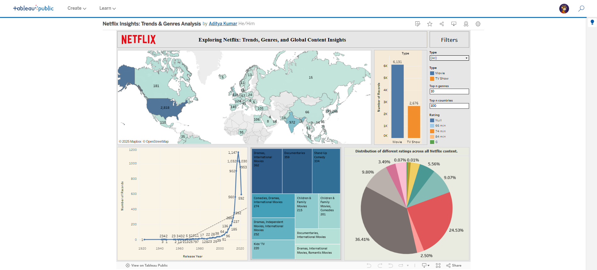
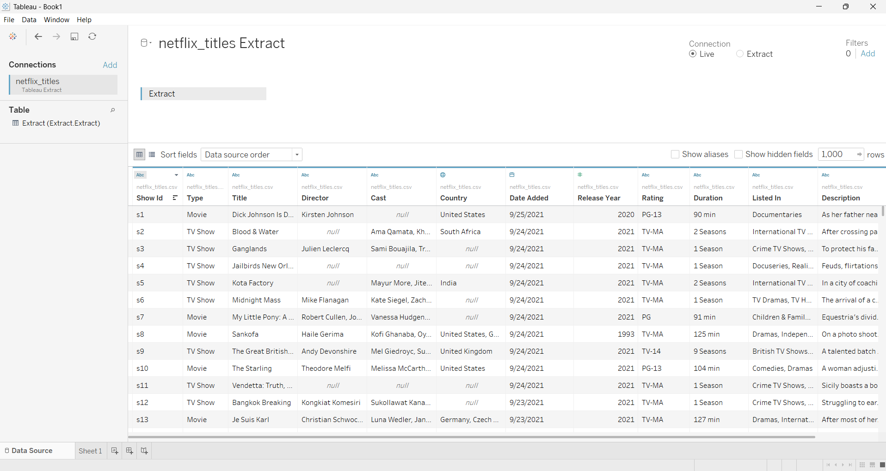
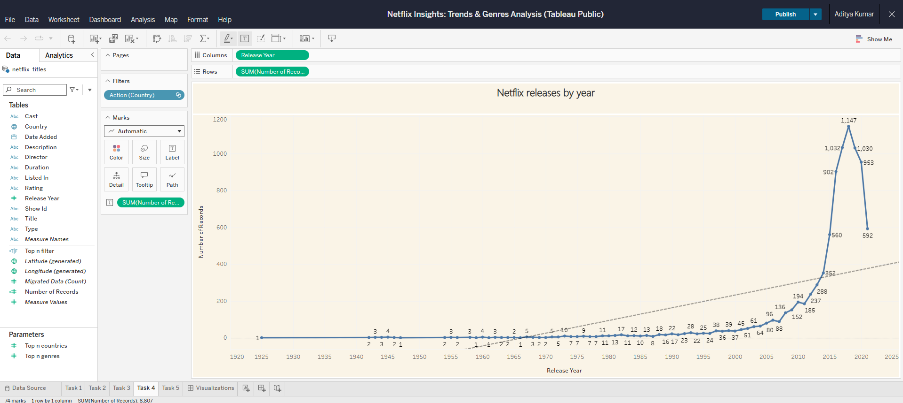
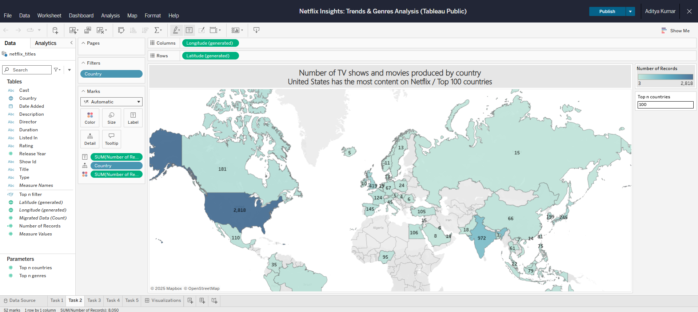
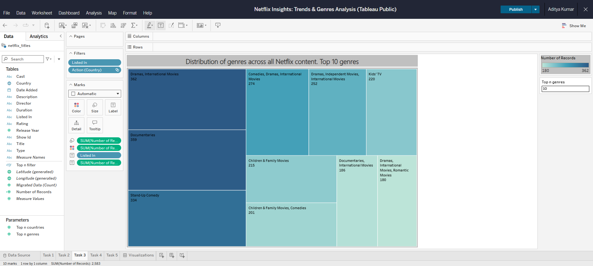
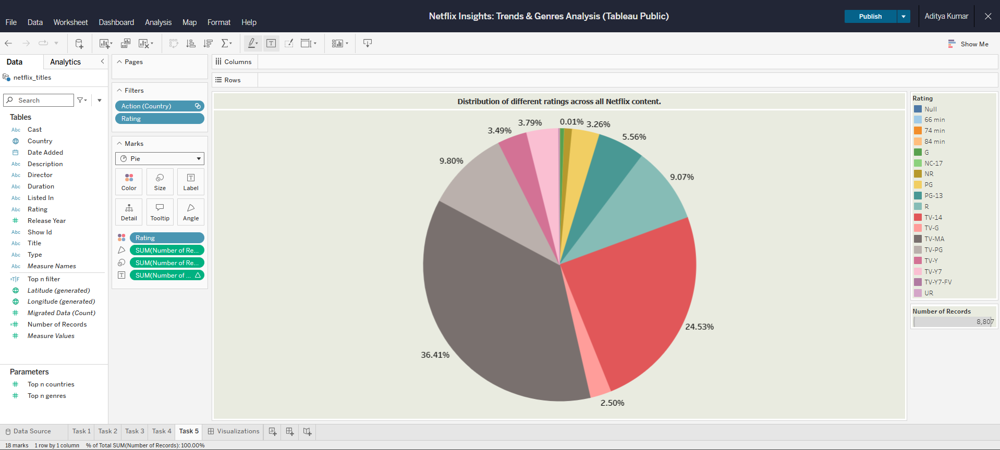
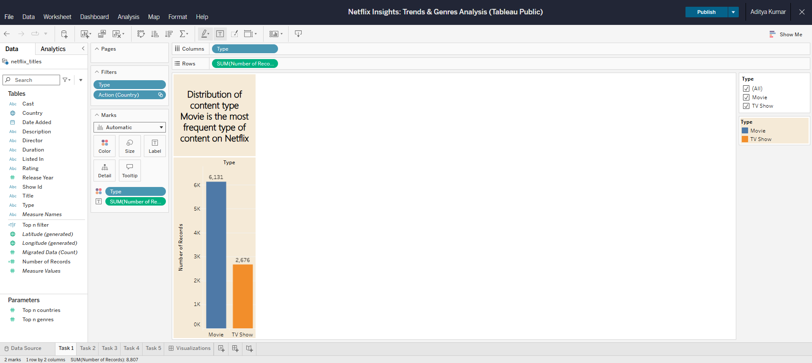
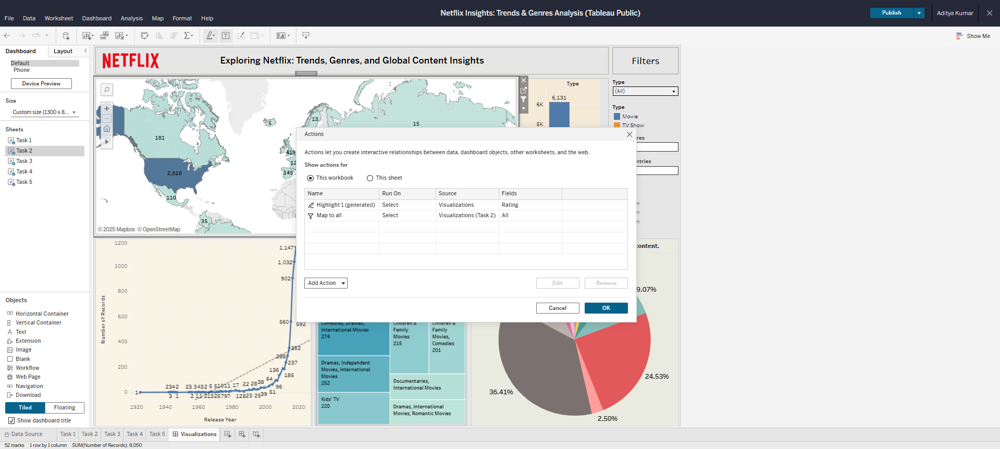
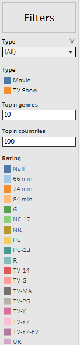

# 🎬 Netflix Insights: Trends & Genres Analysis

This project presents an interactive Tableau dashboard that offers a deep-dive analysis into Netflix's content library. It explores global trends in show releases, genre popularity, and country contributions using a Kaggle dataset.

🔗 **[Live Dashboard on Tableau Public](https://public.tableau.com/app/profile/aditya.kumar6665/viz/GlobalNetflixInsightsTrendsGenres/Visualizations)**  
📦 **Dataset**: [Netflix Shows Dataset - Kaggle](https://www.kaggle.com/datasets/shivamb/netflix-shows)





---

## 📚 Table of Contents

- [📌 Project Highlights](#-project-highlights)  
- [🧰 Tools Used](#-tools-used)  
- [📊 Dataset Summary](#-dataset-summary)  
- [📈 Visualizations & Screenshots](#-visualizations--screenshots)  
  - [1. Shows Released Per Year](#1-shows-released-per-year)  
  - [2. Country-Wise Content Contribution](#2-country-wise-content-contribution)  
  - [3. Distribution of Genre](#3-distribution-of-genre)  
  - [4. Distribution of Different Ratings](#4-distribution-of-different-ratings)  
  - [5. Distribution of Content Type](#5-distribution-of-content-type)  
- [📌 Project Overview](#-project-overview)  
- [📈 Dashboard Components](#-dashboard-components)  
- [🔁 Features & Interactivity](#-features--interactivity)  
- [✅ Outcomes](#-outcomes)  
- [🎛️ Filters and Parameters](#filters-and-parameters)  
- [🧠 Key Insights](#-key-insights)  
- [📂 Files in Repository](#-files-in-repository)  
- [🙏 Acknowledgments](#-acknowledgments)  
- [📬 Contact](#-contact)  


---

## 📌 Project Highlights

- Analyze release trends of movies and shows over time
- Discover top producing countries and genres
- Number of records by content type
- Distribution of different ratings across all Netflix content
- Built using Tableau Public with custom visuals

---

## 🧰 Tools Used

| Tool     | Role                            |
|----------|----------------------------------|
| Tableau  | Dashboarding, Data Analysis      |
| Excel    | Initial dataset formatting       |
| Kaggle   | Dataset source                   |

---

## 📊 Dataset Summary

- **Source**: Netflix Titles Dataset by Shivam Bansal
- **File**: `netflix_titles.csv`
- **Records**: 8,800+ titles
- **Key Fields**: show_id, type, title, director,	cast,	country, date_added, release_year, rating, duration, listed_in,	description
- **Screenshot**:

  

---

## 📈 Visualizations & Screenshots

### 1. Shows Released Per Year
- **Chart**: Line Chart  
- **Formula**:
  ```tableau
  COUNT([Title]) BY YEAR([Date Added])
  ```
- **Screenshot**: 

    
---

### 2. Country-Wise Content Contribution
- **Chart**: Bar Chart  
- **Formula**:
  ```tableau
  COUNT([Title]) by [Country]
  ```
- **Screenshot**: 

    

---

### 3. Distribution of Genre
- **Chart**: Treemaps  
- **Formula**:
  ```tableau
  SPLIT([Listed_in], ",")
  ```
- **Screenshot**: 

   

---

### 4. Distribution of different Ratings
- **Chart**: Pie Chart  
- **Formula**:
  ```tableau
  COUNT([Title]) by [Ratings]
  ```
- **Screenshot**: 

  

---

### 5. Distribution of Content Type
- **Chart**: Horizontal Bar  
- **Formula**:
  ```tableau
  COUNT([Title]) by [Type]
  ```
- **Screenshot**: 

  

---

## 📌 Project Overview

This project aims to deliver data-driven insights on Netflix content trends using interactive Tableau visualizations. It allows users to explore:

- Top N genres on Netflix.
- Countries producing the most Netflix content.
- Show-level exploration based on user interactions.

---

## 📈 Dashboard Components

### 1. 🎭 Top N Genres (Treemap)
- **Visualization**: Treemap
- **Interactivity**: Parameter-driven “Top N” filter.
- **Purpose**: To reveal the most popular genres with a compact visual that shows proportion by count.
- **Highlight**: Users can adjust the parameter to see top 5, 10, 15 genres, etc.
- **Screenshot**:

     .png)

---

### 2. 🌍 Top N Countries (Filled Map)
- **Visualization**: Map (Choropleth)
- **Interactivity**: Parameter-driven filtering of top countries.
- **Purpose**: To highlight Netflix’s global content production by geography.
- **Highlight**: Color intensity indicates the volume of content from each country.
- **Screenshot**: 

    .png)
  
---

### 3. 🗂️ Interactive Netflix Titles Table
- **Visualization**: Table/List view
- **Interactivity**: Filtered using **Dashboard Actions** from Genre and Country visuals.
- **Purpose**: To allow detailed exploration of Netflix shows based on selected genre or country.
- **Screenshot**:

    

---

## 🔁 Features & Interactivity

- **Parameter Controls**:
  - “Top N Genres” and “Top N Countries” dropdowns allow users to dynamically control how many values are shown.
- **Dashboard Actions**:
  - Clicking a country or genre filters the table to show relevant titles.
  - Users can interactively explore content based on region or theme.
- **Screenshot**: 

    

---

## ✅ Outcomes

- Gained hands-on experience with dynamic filtering and dashboard design in Tableau.
- Built a user-driven dashboard that supports storytelling through data visuals.
- Developed an understanding of global media trends using Netflix as a case study.

---

## Filters and Parameters

- **Screenshot**: 

 

### 🔹 What Was Implemented:
A vertical **Filter Panel** was added to the left side of the dashboard, allowing users to control the view based on specific dimensions and parameters:

- **Type Selector**: Filter by content type – `Movie`, `TV Show`, or view `All`.
- **Top N Genres**: A numeric input parameter that dynamically controls the number of genres shown in the Treemap.
- **Top N Countries**: A numeric input parameter that adjusts how many countries are visualized in the Map chart.
- **Rating Filter**: Multi-select option to view titles based on their rating (e.g., PG, R, TV-MA, etc.).

### 🔹 Purpose:
- To **customize the dashboard view** based on the user's interests.
- To **improve user control** over the amount and type of data displayed.
- Makes exploration **more flexible and focused**, especially useful for large datasets like Netflix titles.

### 🔹 Summary Feedback:
- ✅ **Interactive and user-friendly** layout.
- ✅ Enhances **dashboard usability** without overwhelming the user.
- 💡 Consider labeling the numeric inputs (e.g., “Enter number from 1–20”) to guide users on valid input ranges.

These filters make the dashboard **highly dynamic**, letting users tailor their data journey effectively.

---

## 🧠 Key Insights

- Netflix scaled rapidly in 2011–2018.
- Dramas and International Movies dominate.
- USA, India, and UK are top contributors.
- Movies reach the world fast; TV shows build loyal fans over time.

---

## 📂 Files in Repository

| File/Folder                    | Description                                |
|--------------------------------|--------------------------------------------|
| `Netflix_Insights.twbx`        | Tableau Packaged Workbook                  |
| `screenshots/`                 | Contains all chart screenshots and Other   |
| `NetflixDataset.csv`           | Optional: cleaned Netflix CSV file         |
| `README.md`                    | Project overview and documentation         |

---

## 🙏 Acknowledgments

- Dataset by [Shivam Bansal on Kaggle](https://www.kaggle.com/shivamb)
- Visualization and design by **Aditya Kumar**

---

## 📬 Contact

- **LinkedIn**: [Aditya Kumar](https://www.linkedin.com/in/aditya-kumar-199b18180)
- **Tableau**: [Public Profile](https://public.tableau.com/app/profile/aditya.kumar6665)

---

> © 2025 Aditya Kumar — Netflix Trends Dashboard
